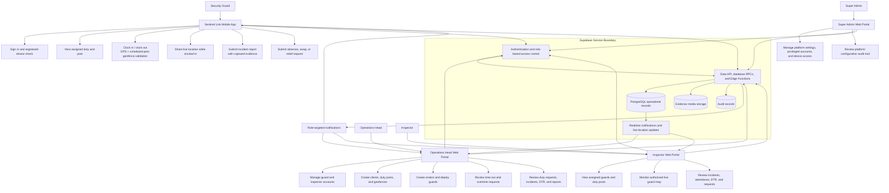

# Operational Framework: Sentinel Link

## Purpose

Sentinel Link supports security-agency operations from personnel setup and duty deployment through verified attendance, live on-duty monitoring, incident reporting, review, and audit. It is a role-based system: a Security Guard uses the mobile app, while the Super Admin, Operations Head, and Inspector use their respective web portals.

## Operational Framework Diagram

## End-to-End Operating Cycle

```mermaid
flowchart LR
    A[1. Platform and personnel setup\nSuper Admin / Operations Head] -->
    B[2. Site and duty configuration\nClient, post, geofence, roster] -->
    C[3. Guard deployment\nApproved schedule is visible in the mobile app] -->
    D[4. Verified duty attendance\nGPS and geofence validated clock-in/out] -->
    E[5. Active-duty monitoring\nLatest authorized GPS fix is shown to authorized staff] -->
    F[6. Incident and request handling\nEvidence, relief, absence, swap, overtime] -->
    G[7. Review, approval, and correction\nOperations Head / Inspector] -->
    H[8. Reporting and accountability\nDTR, incident, personnel, and audit records]

    F -->|urgent event| G
    G -->|decision or update| C
    G -->|approved time-out| H
```

## Role Responsibilities

| Role | Primary interface | Operational responsibility |
|---|---|---|
| Super Admin (`it_admin`) | Super Admin Web Portal | Controls platform configuration, privileged accounts, and device access; reviews configuration audit records. |
| Operations Head (`admin`) | Operations Head Web Portal | Manages personnel, clients, duty posts, geofences, rosters, deployments, time-out/overtime review, duty requests, incidents, and reports. |
| Inspector (`inspector`) | Inspector Web Portal | Reviews assigned guards and posts, authorized live locations, incidents, attendance/DTR records, and requests within the assigned scope. |
| Security Guard (`user`) | Sentinel Link Mobile App | Views assigned duty, performs GPS/geofence-validated attendance, shares location only during an active duty, submits incidents and evidence, and files duty requests. |

## System-Control Rules

1. A guard must be authenticated, active, and assigned to an approved duty before attendance or live-location publication is accepted.
2. Attendance is validated against the scheduled duty post and its configured geofence before an attendance event is recorded.
3. Live location is temporary operational data. The system keeps the latest valid GPS fix only while an eligible attendance session is open; it is removed when duty ends.
4. The Operations Head can manage operational setup and review workflow decisions. Inspectors can only see guards within their authorized assignment scope.
5. All client applications access the Supabase service boundary through authenticated APIs, RPCs, Edge Functions, and Realtime. They do not connect directly to the PostgreSQL database.
6. Sensitive records and evidence media are protected through access control, Row Level Security, and role checks. Incident-photo storage remains an implementation improvement identified in the audit.

## Thesis-Ready Narrative

The Sentinel Link operational framework begins with controlled platform and personnel setup. The Super Admin manages platform-level configuration, privileged access, and device-control functions, while the Operations Head creates client duty posts, configures geofences, prepares rosters, and deploys security guards. Guards receive approved schedules through the mobile application and record attendance only after the system validates their identity, scheduled duty, GPS accuracy, and presence within the assigned geofence. During an active duty, the mobile application submits the guard's latest authorized location for real-time monitoring by authorized Operations Heads and assigned Inspectors. Guards can also submit incident reports with evidence and file duty-related requests. The Operations Head and Inspector review operational records according to their permissions, while the system produces DTR, incident, personnel, and audit records for accountability. All access is mediated by authentication, role-based authorization, database policies, and secured backend services.

## Implementation Alignment

This framework is based on the implemented role routing, attendance and geofence logic, live-location controls, platform configuration audit table, and audit observations in the project. It deliberately represents the Supabase API/RPC/Realtime layer between client applications and the database, rather than depicting a direct client-to-database connection.
